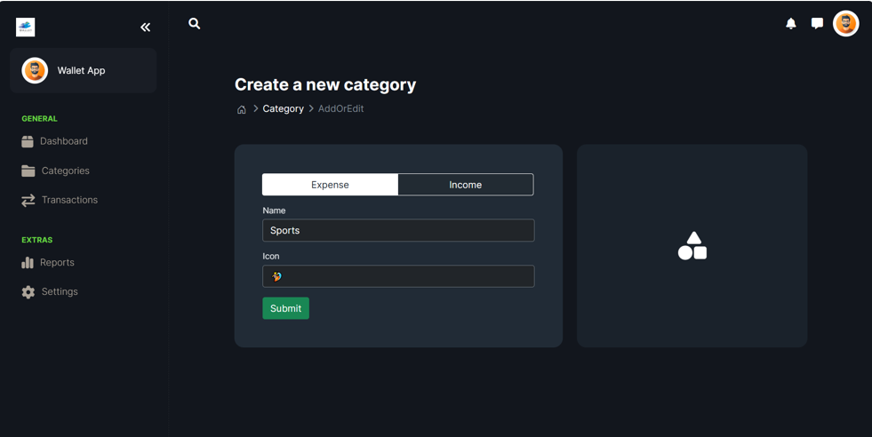
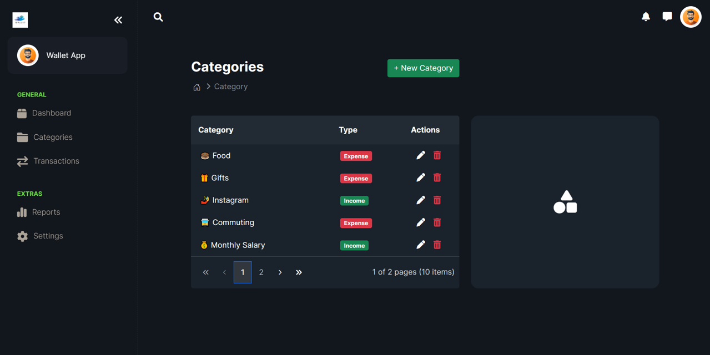
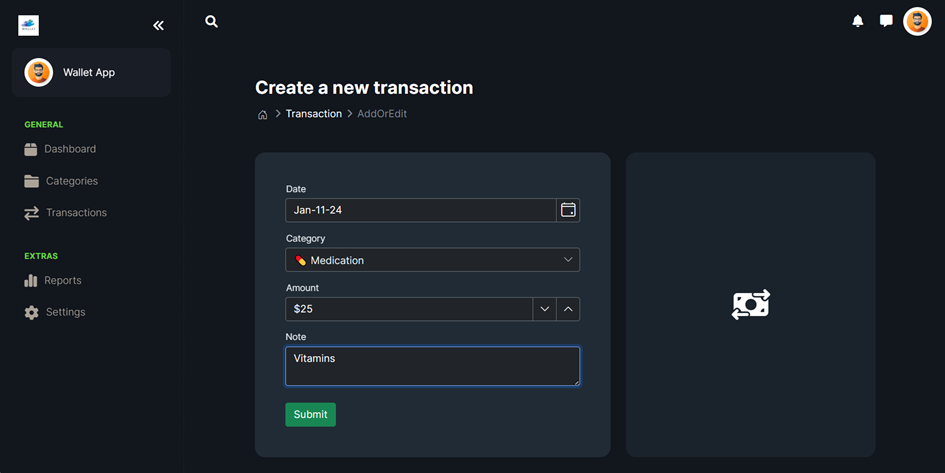
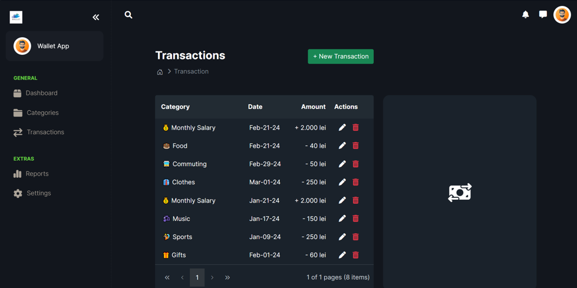
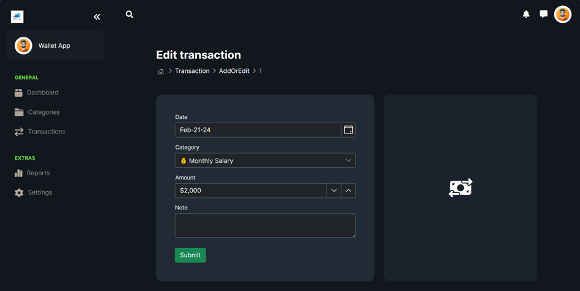
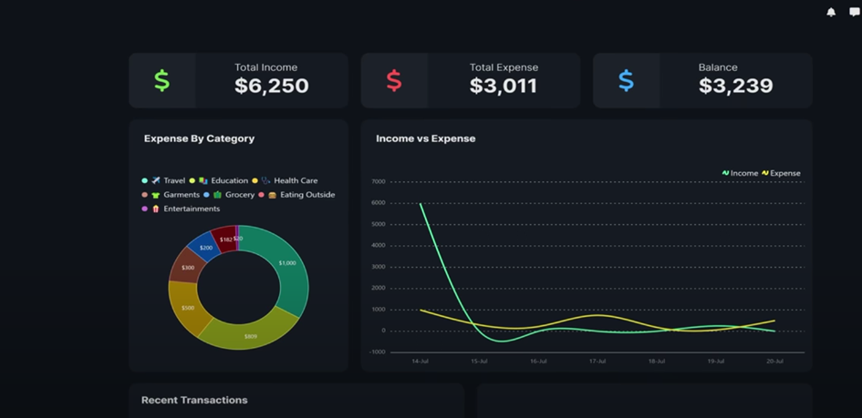
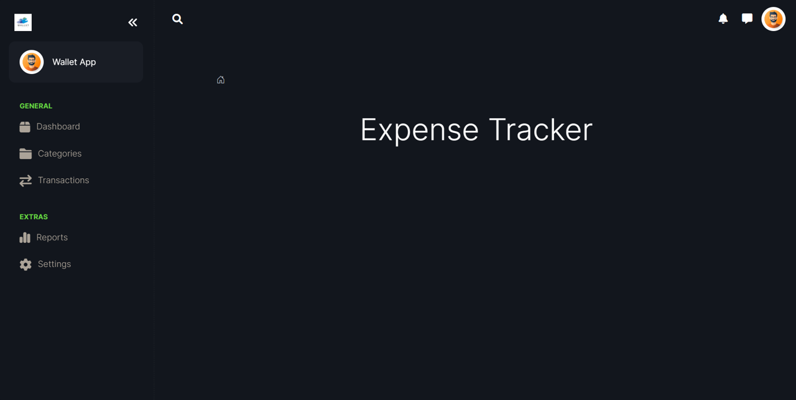

# Expense-Tracker

The Expense Tracker App is a comprehensive application built using .NET Framework, designed to help users monitor their budget and spending effectively. With visual tools such as charts and diagrams, users can gain insights into their financial habits and make informed decisions.

## Features

  - Add a Category of Expense or Income: Users can add new types of expenses and income, categorize them, and set a specific icon to each of them.

  - View Categories: Users can view their created categories.

  - Add a Transaction: Users can add their own spendings and sources of income, select their category, the amount spent/earned and the date of the transaction.

  - View Expenses and Sources of Income: Users can view their expenses.

  - Edit Transactions or Categories

  - Data Visualization: Users can visualize their budget via visual tools such as pie charts and diagrams which provide a clear overview of their financial data.

## Technologies Used

- .NET Framework
- C#
- ASP.NET MVC
- Entity Framework
- HTML/CSS
- JavaScript
- Charting libraries (e.g., Chart.js, Google Charts)

## Screenshots

*Dashboard with Expense Overview*

*Home Page*

